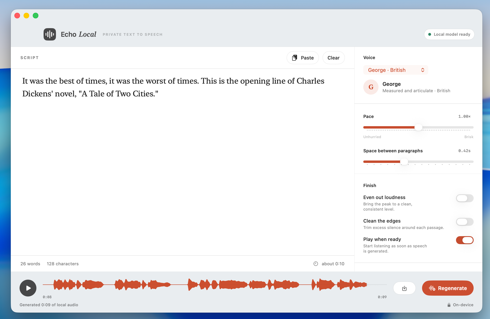

# Echolocal

**A focused, native macOS app for turning pasted text into natural speech on your own Mac.**

Echolocal runs [KokoroSwift](https://github.com/mlalma/kokoro-ios) on Apple silicon through [MLX Swift](https://github.com/ml-explore/mlx-swift). Once the optional model is installed, synthesis, audio processing, and export happen locally. Your text is never sent to a server.



## Highlights

- Paste or write long-form text in a distraction-free editor.
- Choose from five curated American and British Kokoro voices.
- Tune speaking pace, paragraph breathing, loudness normalization, silence trimming, and autoplay.
- Play, pause, scrub, regenerate, and export standard mono WAV audio.
- Split long passages at sentence boundaries before inference, then join them with natural paragraph spacing.
- Download the model only when you explicitly choose to; work offline afterwards.

## Requirements

- Apple-silicon Mac
- macOS 15 or later

## Install

Download the DMG from the [latest GitHub Release](https://github.com/isbkch/echo-local/releases/latest), open it, and drag **Echolocal** into the **Applications** shortcut.

Each published release automatically receives:

- `Echolocal-X.Y.Z.dmg`, containing the app and an Applications shortcut.
- `Echolocal-X.Y.Z.dmg.sha256`, for verifying the downloaded installer.

Release builds are Developer ID-signed and notarized when the repository's Apple release secrets are configured. Until then, the automated fallback is ad-hoc signed; macOS requires Control-clicking the app, choosing **Open**, and confirming the first launch.

## Build from source

- Apple-silicon Mac
- macOS 15 or later
- Xcode 16 or later
- [XcodeGen](https://github.com/yonaskolb/XcodeGen)

## Quick start

```sh
git clone git@github.com:isbkch/echo-local.git
cd echo-local
brew install xcodegen
./scripts/build.sh
open ".build/Build/Products/Release/Echolocal.app"
```

`build.sh` produces a self-contained local release build, embeds the required dynamic frameworks, and verifies its signature. It uses ad-hoc signing for local use. Distribute public builds only after signing and notarizing them with your own Apple Developer credentials.

To create and verify the same drag-to-Applications package locally:

```sh
./scripts/package-dmg.sh 0.12.109
```

The DMG and checksum are written to `dist/`.

For development, generate and open the project instead:

```sh
xcodegen generate
open EchoLocal.xcodeproj
```

## Install the optional local model

At first launch, choose **Download local model**. The app downloads about 330 MB to:

```text
~/Library/Application Support/Echolocal/Kokoro/
```

You can instead choose **Use existing model files…** and select a folder containing:

```text
kokoro-v1_0.safetensors
af_heart.safetensors
af_bella.safetensors
am_michael.safetensors
bf_emma.safetensors
bm_george.safetensors
```

Model weights and voice embeddings are intentionally excluded from this repository and from source distributions.

## Privacy

The App Sandbox is enabled. Network access is used only for an explicit model download; file access is limited to locations you select through macOS system panels. After the model is installed, generation and WAV export are entirely local.

## Test

```sh
xcodegen generate
xcodebuild \
  -project EchoLocal.xcodeproj \
  -scheme EchoLocal \
  -configuration Debug \
  -derivedDataPath .build \
  test \
  CODE_SIGNING_ALLOWED=NO
```

The suite covers text chunking, audio finishing, waveform reduction, and WAV encoding. The optional inference smoke test runs when `kokoro-v1_0.safetensors` and `af_heart.safetensors` exist in `/tmp/echo-local-smoke-model`, or in the directory named by `LOCAL_AUDIO_SMOKE_MODEL_DIR`.

## Maintainer release flow

1. Merge the release commit to `main`.
2. Create and publish a GitHub Release with an `X.Y.Z` or `vX.Y.Z` tag.
3. The **Package Release DMG** workflow checks out that exact tag, runs the test suite, builds the app with the tag as its version, creates and verifies the DMG and checksum, then attaches both files to the release.

The workflow can also be run manually from the Actions tab to package an existing release, including `0.12.109`. Leave **Replace existing** disabled unless a previously uploaded asset intentionally needs to be superseded.

For warning-free installation through Gatekeeper, configure all five repository Actions secrets below. Providing only some of them fails the release rather than silently publishing a partially trusted build.

| Secret | Purpose |
| --- | --- |
| `APPLE_DEVELOPER_ID_CERTIFICATE_BASE64` | Base64-encoded Developer ID Application `.p12` certificate |
| `APPLE_DEVELOPER_ID_CERTIFICATE_PASSWORD` | Password used when exporting that certificate |
| `APPLE_NOTARY_KEY_BASE64` | Base64-encoded App Store Connect API `.p8` key |
| `APPLE_NOTARY_KEY_ID` | App Store Connect API key ID |
| `APPLE_NOTARY_ISSUER_ID` | App Store Connect API issuer ID |

With all five secrets present, the workflow imports the certificate into an ephemeral keychain, signs the nested frameworks and app with hardened runtime and a secure timestamp, signs the DMG, submits it with `notarytool`, staples the accepted ticket, and validates it before upload. With no Apple secrets, packaging still works using the clearly reported ad-hoc fallback.

## License and notices

Echolocal is released under the [MIT License](LICENSE). See [THIRD_PARTY_NOTICES.md](THIRD_PARTY_NOTICES.md) for dependency and model-asset licenses. In particular, compatible Kokoro 82M safetensors are downloaded from [Hugging Face](https://huggingface.co/brannala64/kokoro-82m-safetensors) under Apache-2.0; review upstream terms before redistributing model assets.

## Contributing and security

Contributions are welcome. Read [CONTRIBUTING.md](CONTRIBUTING.md) before opening a pull request. For vulnerabilities, follow [SECURITY.md](SECURITY.md) rather than opening a public issue.
