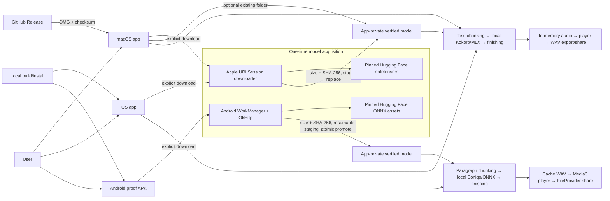

# EchoLocal end-to-end user journeys

This map describes the runtime implemented in this repository. It separates deterministic source/test evidence from distribution, external-host, and physical-device evidence.

## System boundary



There is no first-party runtime backend. There is no account, authentication, sync, cloud text/audio storage, billing, or telemetry path. Network permission exists only for user-initiated model acquisition. GitHub is a macOS distribution boundary, and Hugging Face is a model-supply boundary; neither participates in generation.

## Boundary inventory

| Boundary | macOS | iOS | Android | Evidence and remaining gate |
| --- | --- | --- | --- | --- |
| Distribution | GitHub DMG, SHA-256, signing/notarization workflow | Local/Xcode device build in this repo | Debug-signed proof APK and checksum | Build/package scripts are executable; actual hosted asset, TestFlight/App Store, and Play delivery are separate provider gates. |
| Model source | `brannala64/kokoro-82m-safetensors` at pinned revision | Same as macOS | `soniqo/Kokoro-82M-ONNX` at pinned revision | Manifests pin exact byte sizes and SHA-256 digests. A real fresh download remains an external-host gate. |
| Model installation | Direct download or user-selected folder; staged per-file replace | Direct foreground download; staged per-file replace | Connected WorkManager job; resumable `.part` files; versioned staging and atomic directory promotion | Corruption and interrupted-install behavior are automated. Background/termination behavior still needs device runs. |
| Settings/text | Settings in `UserDefaults`; editor text is memory-only | Same as macOS | Settings in DataStore; editor text in `SavedStateHandle` | Persistence repositories are automated on Android; Apple setting persistence is not currently isolated in tests. |
| Inference | Local KokoroSwift + MLX | Local KokoroSwift + MLX; Simulator rejected before MLX | Local Soniqo SDK + ONNX runtime | Deterministic processing tests run locally. Real inference, latency, thermals, and memory need supported physical hardware and model files. |
| Playback | `AVAudioEngine`, play/pause/scrub | `AVAudioEngine` with spoken-audio session | Media3 player | Android has an instrumentation test; Apple playback callbacks remain a runtime gate. |
| Export/share | User-selected WAV through `NSSavePanel` | Temporary WAV followed by the system share sheet | Cache-only WAV through non-exported `FileProvider` with temporary read access | Encoders and Android share confinement are automated; picker/share-target behavior is manual. |

## User journeys

### EJ-01 — First launch and local-model setup

1. The app checks its private model directory before enabling generation.
2. A missing or invalid installation blocks the editor with an explicit setup surface.
3. The user starts the only routine network action: model download. macOS can instead import an existing model folder.
4. Every asset is checked against its pinned size and SHA-256 digest before becoming ready.
5. Android promotes the complete versioned staging directory atomically. Apple replaces only a fully verified staged file and validates the complete asset set before reporting ready.

Recovery: Apple retries invalid/missing assets without replacing a last-known-good file with an unverified file. Android resumes short partial files with HTTP Range, restarts cleanly if the server returns a full response, retries I/O failures, and never promotes a corrupt staging set.

Executable coverage:

- Apple: `ModelStoreTests/testProductionManifestPinsImmutableIntegrityCheckedAssets`, `testSameSizeCorruptionIsNotTreatedAsReady`, `testCorruptImportCannotReplaceLastKnownGoodModel`, and `testVerifiedImportBecomesReady`.
- Android: `ModelInstallerTest`, `KokoroModelRepositoryTest`, `KokoroModelManifestTest`, and `CompactEcholocalScreenTest/missingModelBlocksEditorWithExplicitSetup`.

### EJ-02 — Author text and choose speech direction

1. The user types or pastes text and chooses a curated voice.
2. macOS/iOS also expose pace; all clients expose paragraph breathing, normalization, silence trimming, and autoplay.
3. Generation is enabled only when nonblank text and a verified local model are both present.

The text is not sent to a service. Apple keeps it in the running `AppModel`; Android uses `SavedStateHandle` to survive activity recreation. Speech preferences persist locally.

Executable coverage: Apple `TextChunkerTests`; Android `DomainBehaviorTest`, `DataStoreSettingsRepositoryTest`, `EcholocalViewModelTest/generateIsEnabledOnlyForReadyModelAndNonblankText`, and responsive-state instrumentation.

### EJ-03 — Generate long-form speech offline

1. The client snapshots the text and settings and passes only local model paths to its native inference engine.
2. Long paragraphs are split at sentence/word boundaries with a 700-character ceiling; oversized words are hard-bounded without dropping content.
3. Each chunk is synthesized locally. Apple additionally refines a chunk in place when Kokoro reports its post-G2P token limit.
4. Silence trimming runs per chunk, paragraph pauses are inserted, and normalization runs once over the joined buffer.
5. A waveform and playable audio are published only after finishing succeeds.

Executable coverage:

- Apple: `TextChunkerTests`, `AudioProcessorTests`, and the optional `KokoroInferenceSmokeTests` with local model files.
- Android: `DomainBehaviorTest/oversizedParagraphIsBoundedWithoutDroppingWords`, `SpeechGeneratorTest/longSingleParagraphReachesTheEngineInBoundedOrder`, `AudioProcessorTest`, and `SoniqoTtsEngineTest`.

Acceptance still requires generating in Airplane Mode after a cold relaunch on a physical iPhone and the named Android device. Unit tests prove that production generation code accepts local paths and has no network collaborator; they do not prove an absence of runtime packets from every bundled native dependency.

### EJ-04 — Failure, cancellation, and regeneration

Android exposes cancellation, invalidates stale generation IDs, asks the native engine to stop, and keeps the last good WAV when regeneration fails. Apple disables a second generation while work is active, guards asynchronous callbacks with a generation ID, and retains the last loaded player buffer if a new run fails.

Executable coverage: Android `EcholocalViewModelTest/staleGenerationCannotReplaceNewerResult`, `cancellationStopsEngineWithoutBecomingFailure`, `failedRegenerationKeepsLastGoodAudio`, and `SpeechGeneratorTest/failurePreservesPriorArtifactAndDiscardsTheEngine`. Apple token-limit recovery is covered by `testRejectedChunksAreRefinedUntilTheSynthesizerAcceptsThem`; AppModel-level failure/race behavior is not yet dependency-injected for deterministic testing.

### EJ-05 — Play, pause, scrub, and relisten

Successful generation loads one finished buffer/file into the platform player. Seeking clamps to the generated duration. Apple rejects stale completion callbacks with a playback UUID; Android observes a single Media3 snapshot flow.

Executable coverage: Android `Media3AudioPlayerTest/generatedWavCanLoadPlayPauseAndSeek` on an emulator/device. Apple audio finishing is unit-tested, but AVAudioEngine graph behavior needs an app runtime.

### EJ-06 — Export or share a WAV

macOS writes a standard mono PCM WAV to a user-selected URL. iOS writes to a unique temporary export directory and opens the share sheet only after the file is complete. Android publishes a completed cache WAV, then shares only a canonical `.wav` below the generated cache directory through a non-exported `FileProvider` and a temporary read grant.

Executable coverage: Apple `WAVEncoderTests`; Android `WavEncoderTest`, `GeneratedAudioStoreTest`, and `ShareIntentFactoryTest`.

### EJ-07 — Relaunch and remain offline

On relaunch, the client revalidates the installed model. With a valid installation, authoring, generation, playback, and export do not require GitHub, Hugging Face, or a first-party service.

This is a physical acceptance gate: install the model, force-quit, enable Airplane Mode, relaunch, then generate, play, seek, regenerate, and export/share. Record cold/warm generation time and peak memory on the oldest supported iPhone and the selected Android device.

## Risk-ranked test plan

| Priority | Scenario | Automated assertion | Runtime/provider assertion |
| --- | --- | --- | --- |
| P0 | Supply-chain drift or same-size corruption marks a model ready | Both platform manifests pin immutable revisions, sizes, and SHA-256; corrupt installs remain unavailable and cannot replace a good model. | Fresh model download from each pinned host revision. |
| P0 | Long input is dropped, sent as one unsafe request, or fails at the Kokoro token boundary | Both platforms preserve ordered words while bounding chunks; Apple adaptively refines post-G2P rejection. | Generate a multi-minute fixture on physical devices and listen across chunk/paragraph boundaries. |
| P0 | “Offline” generation still reaches the network | Generation constructors accept verified local directories/files and have no downloader dependency. | Capture device traffic during cold offline generation; confirm zero attempted runtime connections. |
| P1 | Interrupted download destroys the last usable model | Invalid staging never promotes; Android Range/full-response recovery is covered. | Interrupt/background/kill setup on iOS and Android, then retry and relaunch. |
| P1 | Cancelled/stale work overwrites newer audio | Android generation IDs and cancellation are covered; Apple generation/playback IDs guard callbacks. | Rapid cancel/regenerate on Android and play/seek/regenerate on Apple. |
| P1 | Export leaks a wrong or partial file | WAV format/publish and Android canonical share boundary are covered. | Open the exported WAV in an independent player and exercise iOS/Android share targets. |
| P1 | Release artifact differs from tested source | macOS packaging validates dependencies, signature, DMG, and checksum; Android helper tests before assembling. | Download the hosted DMG independently; verify checksum, image, Gatekeeper/notarization. Install the exact APK checksum on the named device. |

## Suite commands

```sh
# Shared Apple/macOS deterministic suite
xcodegen generate
APPLE_TEST_DERIVED=$(mktemp -d /tmp/echolocal-tests.XXXXXX)
xcodebuild -project EchoLocal.xcodeproj -scheme EchoLocal -configuration Debug \
  -derivedDataPath "$APPLE_TEST_DERIVED" test CODE_SIGNING_ALLOWED=NO

# iOS compile gate (MLX inference still requires a physical iPhone)
IOS_BUILD_DERIVED=$(mktemp -d /tmp/echolocal-ios-build.XXXXXX)
xcodebuild -project EchoLocal.xcodeproj -scheme EchoLocaliOS -configuration Debug \
  -destination 'generic/platform=iOS' -derivedDataPath "$IOS_BUILD_DERIVED" \
  build CODE_SIGNING_ALLOWED=NO

# Shared suite plus the Simulator-specific preflight assertion
IOS_TEST_DERIVED=$(mktemp -d /tmp/echolocal-ios-tests.XXXXXX)
xcodebuild -project EchoLocal.xcodeproj -scheme EchoLocaliOS -configuration Debug \
  -destination 'platform=iOS Simulator,name=AVAILABLE_DEVICE_NAME' \
  -derivedDataPath "$IOS_TEST_DERIVED" test CODE_SIGNING_ALLOWED=NO

# Android deterministic suite and debug artifact
cd android
./gradlew :app:testDebugUnitTest :app:assembleDebug

# Android runtime player/responsive-state tests when a selected device is attached
./gradlew :app:connectedDebugAndroidTest
```

Passing these commands is source/build evidence. It does not close the physical inference, model-host availability, OS share sheet, signed distribution, or hosted artifact gates above.

## Verification snapshot — 2026-09-01

- macOS `EchoLocal` XCTest: 16 executed, 0 failures, 2 real-model smoke tests skipped because model files were not supplied.
- iOS `EchoLocaliOS` XCTest on Simulator: 17 executed, 0 failures, the same 2 smoke tests skipped; the Simulator-before-MLX preflight test passed.
- iOS generic-device, signing-free build: succeeded.
- macOS release-shaped local build: succeeded; the helper verified dependencies and the ad-hoc app signature.
- Android JVM suite: 46 executed, 0 failures; the helper assembled the debug APK and wrote its SHA-256 checksum.
- Android instrumentation: not run because `adb devices -l` reported no attached device.
- Physical iPhone/Android inference, Airplane Mode, latency/memory, playback/share, real model-host download, and signed/hosted distribution remain separate acceptance gates.
